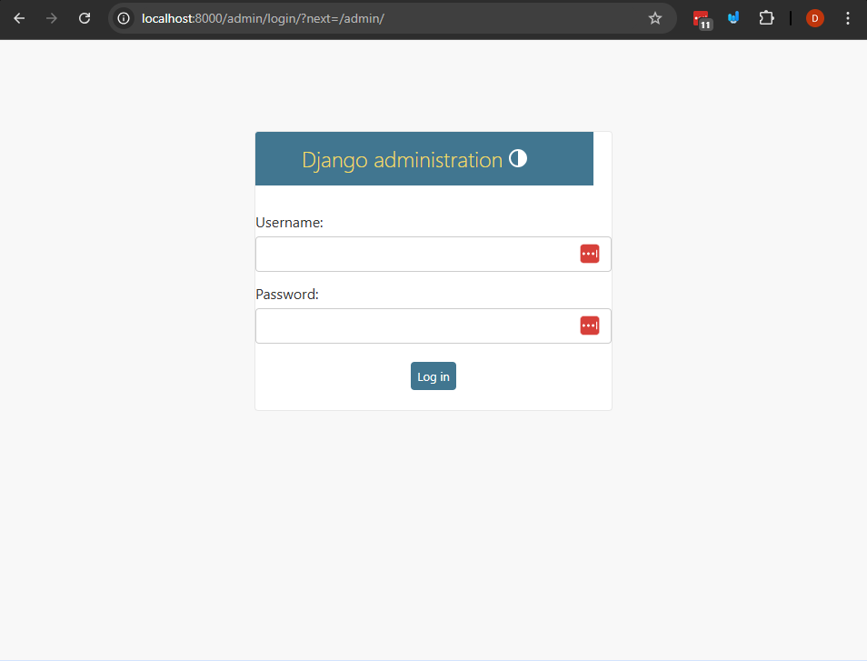
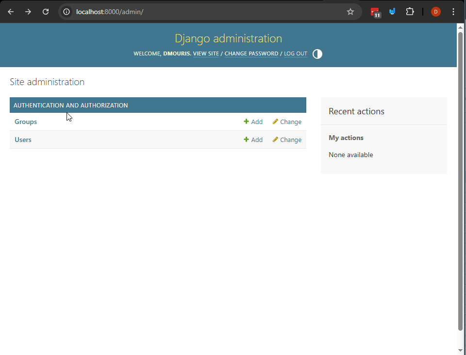
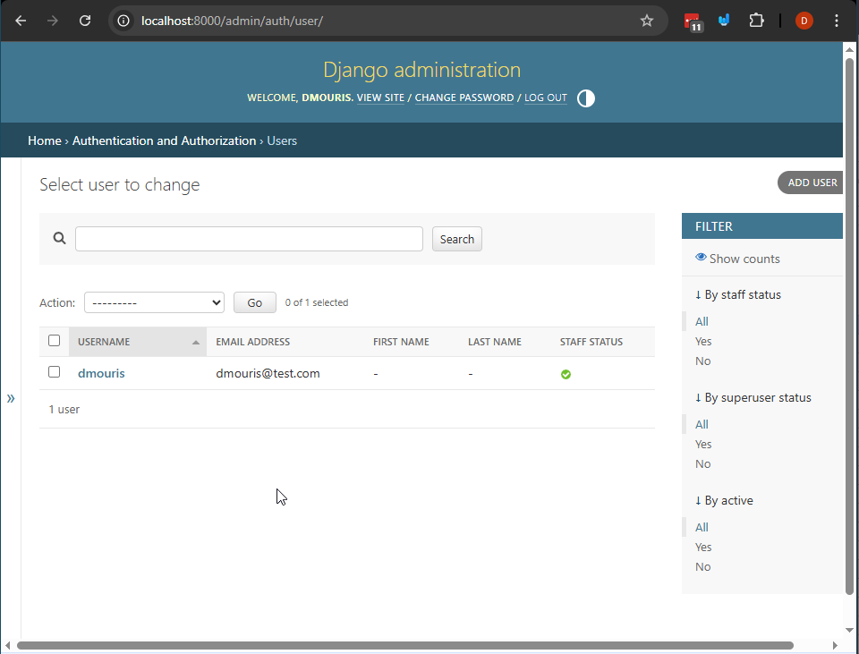
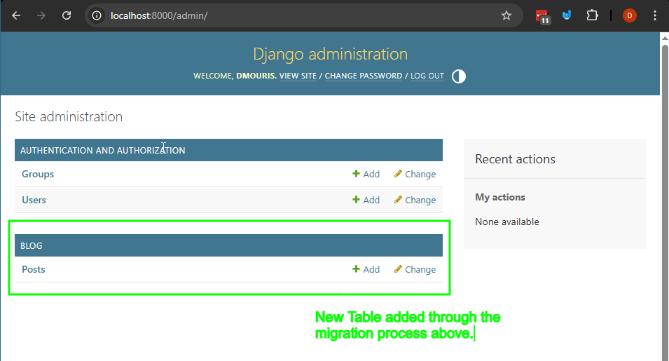
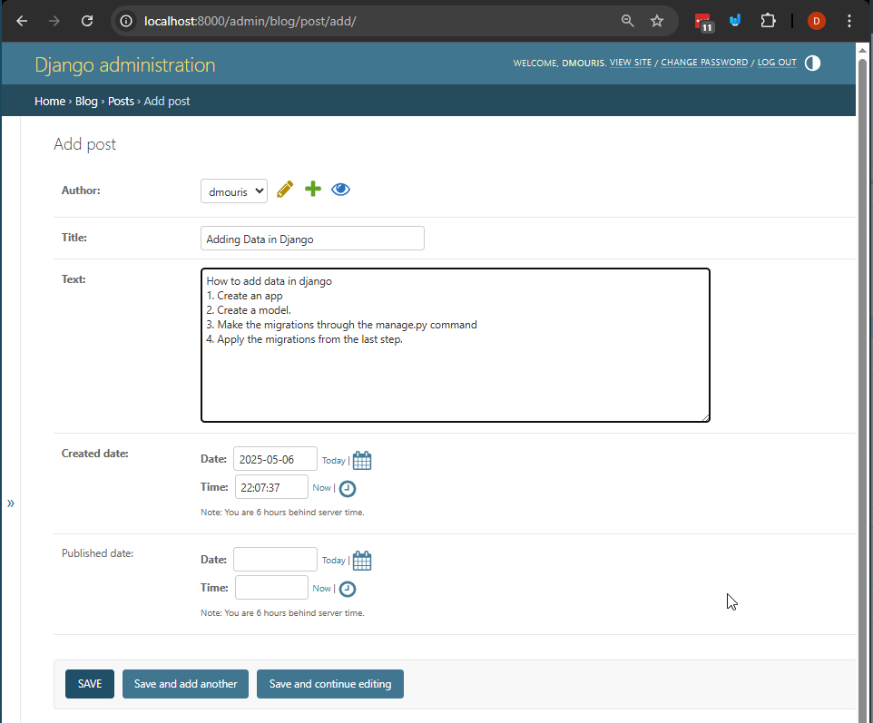

# Intro to Django and Backend Web Development fundamentals

In this example we'll be continuing the example from last class but we'll be going over concepts that we'll go into more detail throughout the course.


## Steps

1. Create a virtual envirnment and install Django
`python -m venv ./venv`

activate the virtual environment:
- linux/mac: `source ./venv/bin/activate`
- windows: `.\venv\Scripts\activate`

2. Install the requirements for the project from the requirements.txt file:
- check that you don't have the requirements installed already:
`pip freeze` this should show nothing if you just created the virtual environment.
- install the requirements:
`pip install -r requirements.txt`
- check that you have the requirements installed:
`pip freeze` this should show the requirements that are installed in the virtual environment.

3. Go into the `myblogwebsite` directory and run the server:
- navigate to the directory:
`cd myblogwebsite`
- run the server:
`python manage.py runserver`

4. Observe the ouptput of the server
```
Watching for file changes with StatReloader
Performing system checks...

System check identified no issues (0 silenced).

You have 18 unapplied migration(s). Your project may not work properly until you apply the migrations for app(s): admin, auth, contenttypes, sessions.
Run 'python manage.py migrate' to apply them.
May 06, 2025 - 15:09:54
Django version 5.2, using settings 'myblogwebsite.settings'
Starting development server at http://127.0.0.1:8000/
Quit the server with CTRL-BREAK.

WARNING: This is a development server. Do not use it in a production setting. Use a production WSGI or ASGI server instead.
For more information on production servers see: https://docs.djangoproject.com/en/5.2/howto/deployment/
```
- The server is running but there's a warning about unapplied "migrations".
- Migrations are a way to keep track of changes to the database schema, to keep it in sync with the models in the code. We'll be going over this in more detail later in the course.

5. Apply the migrations to create the default database tables.
Note: Migrations are a way to keep track of the changes to the database schema (which is all of the tables and columns in the database). Django comes with a lot of built in migrations that are used to simplify the process of creating a web applications.

- let's stop the server with `CTRL-C` and apply the migrations:
`python manage.py migrate` You should see something like this:
```
$ python manage.py migrate
Operations to perform:
  Apply all migrations: admin, auth, contenttypes, sessions
Running migrations:
  Applying contenttypes.0001_initial... OK
  Applying auth.0001_initial... OK
  Applying admin.0001_initial... OK
  Applying admin.0002_logentry_remove_auto_add... OK
  Applying admin.0003_logentry_add_action_flag_choices... OK
  Applying contenttypes.0002_remove_content_type_name... OK
  Applying auth.0002_alter_permission_name_max_length... OK
  Applying auth.0003_alter_user_email_max_length... OK
  Applying auth.0004_alter_user_username_opts... OK
  Applying auth.0005_alter_user_last_login_null... OK
  Applying auth.0006_require_contenttypes_0002... OK
  Applying auth.0007_alter_validators_add_error_messages... OK
  Applying auth.0008_alter_user_username_max_length... OK
  Applying auth.0009_alter_user_last_name_max_length... OK
  Applying auth.0010_alter_group_name_max_length... OK
  Applying auth.0011_update_proxy_permissions... OK
  Applying auth.0012_alter_user_first_name_max_length... OK
  Applying sessions.0001_initial... OK
```
- All this is doing is creating the tables in the database that are needed for the admin interface and authentication.
- Note this is using the `manage.py` command line tool when we created the project (we'll be using this a lot).
- Let's take a look at the database tables that are created by taking a look at the admin interface.

6. Take a look database tables created by the migrations with the admin interface.
- Create a super user to access the admin interface:
`python manage.py createsuperuser`
- Enter a username, email and password. This will create a super user that can access the admin interface. The output should look like this (you'll need to enter a username, email and password):
```
$ python manage.py createsuperuser
Username (leave blank to use 'dmouris'):
Email address: dmouris@test.com
Password:
Password (again):
Superuser created successfully.
```
- Make note of the credentials you entered (if you don't remember just make another one)
- Start the server again:
`python manage.py runserver` Note that now you don't see the warning about unapplied migrations. It should look like this:
```
$ python manage.py runserver
Watching for file changes with StatReloader
Performing system checks...

System check identified no issues (0 silenced).
May 06, 2025 - 15:19:56
Django version 5.2, using settings 'myblogwebsite.settings'
Starting development server at http://127.0.0.1:8000/
Quit the server with CTRL-BREAK.

WARNING: This is a development server. Do not use it in a production setting. Use a production WSGI or ASGI server instead.
For more information on production servers see: https://docs.djangoproject.com/en/5.2/howto/deployment/
```
- Open your browser and navigate to `http://localhost:8000/admin/` and you should see the following page 

- Enter your credentials to the above login page and you should see the following page 

- This displays the tables created by the migrations.
  - If you click on the `Users` link you should see the following page 
  - You can see the super use that you created.

7. Let's create a new app called `blog` and add it to the project, this will be used to create a blog app that will have posts that can be created and viewed in the admin interface.
- Note: In django pieces of functionality are called "apps", for us we're going to create a app called `blog` that will have "posts" that will be saved to the database (and also available in the admin interface).
- let's stop the server with `CTRL-C` and create a new app called `blog`:
`python manage.py startapp blog`
Note: this will create a new directory called `blog` with the following structure (within the `myblogwebsite` directory):
```
myblogwebsite/
    manage.py
    myblogwebsite/
        __init__.py
        settings.py
        urls.py
        asgi.py
        wsgi.py
    blog/
        __init__.py
        admin.py
        apps.py
        migrations/
            __init__.py
        models.py
        tests.py
        views.py
```
- The most important files are:
  - `models.py`: this is where you define the models for the app. This is where you define the database tables and fields for the app.
    - You do this in python but this will be closely related to all of the knowledge you have of SQL and databases.
  - `admin.py`: this is where you define the admin interface for the app. This is where you define how the models will be displayed in the admin interface.
  - `views.py`: this is where you define the views for the app. This is where you define how the app will be displayed to the user.

- We need to add this app to the project so that it can be used in the project. To do this we need to add it to the `INSTALLED_APPS` list in the `settings.py` file. Open the `settings.py` file and add the following line to the `INSTALLED_APPS` list:
```python
INSTALLED_APPS = [
    'django.contrib.admin',
    'django.contrib.auth',
    'django.contrib.contenttypes',
    'django.contrib.sessions',
    'django.contrib.messages',
    'django.contrib.staticfiles',
    # Custom Apps
    'blog',  # add this line to add the blog app to the project
]
```

8. Let's add a `Post` model to the `blog/models.py` file, and perform all of the steps to add this to the database and admin interface.
- Open the `blog/models.py` file and add the following code to create a `Post` model:
```python
from django.conf import settings
from django.db import models
from django.utils import timezone


class Post(models.Model):
    author = models.ForeignKey(settings.AUTH_USER_MODEL, on_delete=models.CASCADE)
    title = models.CharField(max_length=200)
    text = models.TextField()
    created_date = models.DateTimeField(default=timezone.now)
    published_date = models.DateTimeField(blank=True, null=True)

    def publish(self):
        self.published_date = timezone.now()
        self.save()

    def __str__(self):
        return self.title
```
- This creates a `Post` model (and a table in the database) with the following fields:
  - `author`: a foreign key to the user model (this is the user that created the post)
  - `title`: a char field with a max length of 200 characters
  - `text`: a text field for the body of the post
  - `created_date`: a date time field for when the post was created (this is set to the current time by default)
  - `published_date`: a date time field for when the post was published (this is blank and null by default)

- The `publish` method is used to set the published date to the current time and save the post to the database.
- The `__str__` method is used to return the title of the post when it is displayed in the admin interface.

- Note: This is a fundamental model and we'll go over this a lot more in detail in the course. For now this is just a way to get your python code into the database and display it in the admin interface.

- Now we need to create a migration for this model and apply it to the database. To do this we need to run the following commands:
`python manage.py makemigrations blog`
- The output should look like this:
```
$ python manage.py makemigrations blog
Migrations for 'blog':
  blog\migrations\0001_initial.py
    + Create model Post
```
- This creates a migration file in the `blog/migrations` directory called `0001_initial.py`. This file contains the code to create the `Post` model in the database, but doesn't apply it yet.
- Now we need to apply the migration to the database:
`python manage.py migrate blog` The output should look like this:
```
Operations to perform:
  Apply all migrations: admin, auth, blog, contenttypes, sessions
Running migrations:
  Applying blog.0001_initial... OK
```

- This applies the migration to the database and creates the `Post` table in the database.

- Now let's add the `Post` model to the admin interface so that we can view and edit it in the admin interface. To do this we need to open the `blog/admin.py` file and add the following code:
```python
from django.contrib import admin

from .models import Post

admin.site.register(Post)
```
- This registers the `Post` model with the admin interface so that it can be viewed and edited in the admin interface.

9. Let's start the server again and view the `Post` model in the admin interface.
- Start the server again: `python manage.py runserver`
- login to the admin interface at `http://localhost:8000/admin/` with the super user credentials you created earlier. You should now see the `Posts` link in the admin interface 

10. Let's add our first post to the admin interface.
- Click on the `Posts` link.
  - It should say "No posts available" because we haven't added any posts yet.
- Click on the `Add Post` button (top right) and you should see the following page, add the data into the fields and then click Save.
- Note: this saved all of the data to the database so that you can access it again later.

11. Let's programmatically get the data from the database in the shell.
- You are familiar with the shell from the first semester, but now we're going to use the shell from django (very similar to the python shell) to access this data.
- Stop the server with `CTRL-C` and run the following command:
`python manage.py shell`
- Let's import the `Post` model and get all of the posts from the database:

```python
>>> from blog.models import Post
>>> all_posts = Post.objects.all()
>>> all_posts
<QuerySet [<Post: Adding Data in Django>]>
>>> all_posts[0].title
'Adding Data in Django'
>>> all_posts[0].text
'How to add data in django\r\n1. Create an app\r\n2. Create a model.\r\n3. Make the migrations through the manage.py command\r\n4. Apply the migrations from the last step.'
```
- This gets all of the posts from the database and stores them in a variable called `all_posts`. You can see that it returns a `QuerySet` which is a list of all of the posts in the database. You can also see that it returns the title of the post as well.
- You can also access the fields of the post by using the dot notation (e.g. `all_posts[0].title` to get the title of the first post).
- We'll take a deeper look at this in upcoming lessons.
- Note: to exit the shell you can use `CTRL-D` or `exit()`.

## Conclusion

You just did many of the steps that are needed to create a web application.

- You created a virtual environment and installed django.
- You created a project and an app.
- You created a model and applied it to the database.
- You created a super user and logged into the admin interface.
- You created a post in the admin interface and viewed it in the shell.
