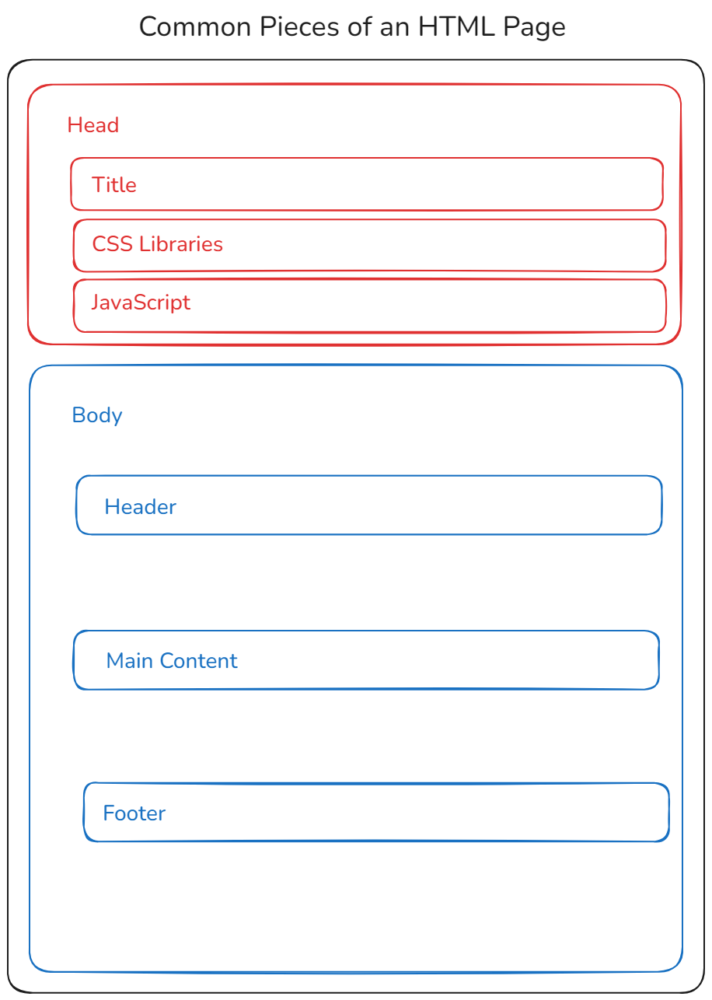
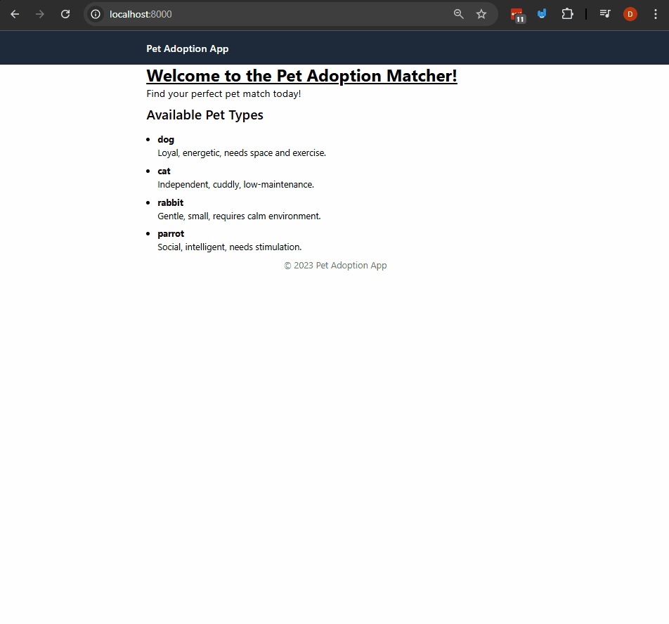

# Base Template, Blocks, Extending Templates, and Links in Django and Jinja

In this example we'll be learning how views and urls work togother.

Throughout the course we'll be using an architecture pattern called Model-View-Template (which is very closesly related to Model-View-Controller) that allows us to connect all of our code together while still being organized. Urls and views

Note these architecture patterns are used for almost every backend framework.

A url is a path to your website that will link to a "view" which is a special django function that you will take in a request and provide a response which will be data passed into a template which will be rendered with that data.


## Steps

### 1. Create a virtual envirnment and install Django
`python -m venv ./venv`

activate the virtual environment:
- linux/mac: `source ./venv/bin/activate`
- windows: `.\venv\Scripts\activate`

### 2. Install the requirements for the project from the requirements.txt file:
- check that you don't have the requirements installed already:
`pip freeze` this should show nothing if you just created the virtual environment.
- install the requirements:
`pip install -r requirements.txt`
- check that you have the requirements installed:
`pip freeze` this should show the requirements that are installed in the virtual environment.


### 3. Navigate inside the `urls_views_fundamentals` directory, run the migrations and run the server.
- Migrate all of the changes that we've done so far.
`python manage.py migrate`
- Run the server with the command:
`python manage.py runserver`


### 4. Let's talk about base templates, blocks, inheritance, and how to use them in Django.
- You can see in the templates that we've been using in our project, and any project that has dynamic content, there's a lot of repeated html code.
- Below is a conceptual diagram of the pieeces of html that will always be in our templates.

- What we're going to do is create a base template that will have all of the repeated html code, and then we'll create other templates that will extend this base template and fill in the blocks with the content that we want to display.
  - This will allow us to have a consistent look and feel across our website, and also make it easier to update the look and feel of our website in the future.

- Here's the process that we can use to do this with Jinja
  - Create a `base.html` template that will have boilerplate html code.
  - Inside of the `base.html` template, we'll create blocks that will be filled in by the other templates.
    - the syntax is ``.
  - Then inside of our apps when we create a template we will "extend" this base template by using the `` tag at the top of the template.
    - Then we can fill in the blocks that we created in the base template by using the `` tag.

### 5. Let's Create a base template and extend it to our templates in the `pet_adoption` app.
- Inside of our project create a new directory called `templates` and inside of that directory create a file called `base.html`.
- Inside of the `base.html` file, add the following code:
```html
<!doctype html>
<html>
  <head>
    <meta charset="UTF-8" />
    <meta name="viewport" content="width=device-width, initial-scale=1.0" />
    <!-- Note we're keeping this out so that it won't get overwritten -->
    <script src="https://cdn.jsdelivr.net/npm/@tailwindcss/browser@4"></script>
    
    
    <title>
        Pet Adoption App
    </title>
  </head>
  <body>
    <header>
        
    </header>
    <main>
        

    </main>
    <footer>
        
            <p class="text-center text-gray-500">
                &copy; 2023 Pet Adoption App
            </p>
        
    </footer>
  </body>
</html>
```
- This has the following blocks:
  - `css_styles`: for adding css styles to the page.
  - `js_scripts`: for adding javascript scripts to the page.
  - `title`: for setting the title of the page.
  - `header`: for adding a header to the page.
  - `content`: for adding the main content of the page.
  - `footer`: for adding a footer to the page.
- Inside of the `urls_views_fundamentals/settings.py` file, add the following line to the `TEMPLATES` setting:
```python
TEMPLATES = [
    {
        "BACKEND": "django.template.backends.django.DjangoTemplates",
        "DIRS": ["templates"], # add this line so sour base template can be found
        "APP_DIRS": True,
        "OPTIONS": {
            "context_processors": [
                "django.template.context_processors.request",
                "django.contrib.auth.context_processors.auth",
                "django.contrib.messages.context_processors.messages",
            ],
        },
    },
]

```
- Now we can use this template, and we won't need to repeat the same html in every template that we create.


### 6. Let's change our templates in the `pet_adoption` app to extend the base template.
- Open the `pet_adoption/templates/pet_adoption/home_page.html` file and change it to the following:
```html


Welcome to Pet Adoption Matcher


    <div class="max-w-2xl mx-auto">
        <h1 class="text-3xl font-bold underline">
          Welcome to the Pet Adoption Matcher!
        </h1>
        <p class="text-lg mb-2">Find your perfect pet match today!</p>
        <!-- New section using jinja templates -->
        <section>
            <h2 class="text-2xl font-semibold mb-4">Available Pet Types</h2>
            <ul class="list-disc pl-5">
            
                <li class="mb-2">
                    <!-- This is the key-->
                    <strong>{{ pet_type }}</strong>
                    <div>
                        <!-- This is the whic hsi a dictionary itself -->
                        {{pet.traits}}
                    </div>
                </li>
            
            </ul>

        </section>
    </div>

```
- Note you can see the change that we've just removed the repeated html code and replaced it with the blocks that we created in the base template.
- Note: if you're getting into an error make sure you have the `base.html` file in the `templates` directory and that the `DIRS` setting in the `TEMPLATES` setting in the `urls_views_fundamentals/settings.py` file is set to `["templates"]`.

- **IMPORTANT NOTE**: If you ever want to keep the contents of a block and then override part of it below you can use the `{{ block.super }}` tag. This will keep the contents of the block and then you can add more content below it. For example:_
```html

    {{ block.super }}
    <p>This is some additional content that will be added to the content block.</p>

```

### 7. Let's change the `pet_adoption/templates/pet_adoption/pet_details.html` template to extend the base template.

- Let's open the `pet_adoption/templates/pet_adoption/pet_details.html` file and change it to the following:
```html


Pet Details - {{ pet.name }}


<div class="max-w-2xl mx-auto">
    <h1 class="text-3xl font-bold underline">
        Is a {{pet_type}} the right match for you?
    </h1>
    <section>
        
        <h2 class="text-2xl font-semibold mb-4">Pet Details</h2>
        <p class="text-lg mb-2">
            The traits of a {{pet_type}} are: {{pet_data.traits}}
        </p>
        
        <p class="text-lg mb-2">
            Sorry, we don't have any information about this pet type.
        </p>
        
    </section>
</div>


```

### 8. Let's add a nav bar to the base template and see how the child templates behave.

- Open the `base.html` file and add the following code inside the `<header>` block:
```html
    <!-- ... boilerplate code above ... -->
    <header>
        
            <nav class="bg-gray-800 p-4">
                <div class="max-w-2xl mx-auto flex justify-between items-center">
                    <a href="/" class="text-white text-lg font-semibold">Pet Adoption App</a>
                </div>
            </nav>
        
    </header>
    <!-- ... boilerplate code below ... -->
```
- This adds a small navbar to the to the page with that links to the home page.
  - if you navigate to the home page you should see the navbar at the top of the page.
  - if you navigate to the pet details page you should see the navbar at the top of the page as well.
  - Hopefully this gives you a better idea what you can do with the base templates.

### 9. Let's add some links using the `url` template tag to the navbar and in our code.
- jinja has a special template tag called `url` that allows us to create links to our views, this is based on the `name` of the views that we create in the `urls.py` file.
- If you open `pet_adoption/urls.py` you can see that we have a view called `home_page` and a view called `pet_type_details`.
```python
from django.urls import path
from .views import home_page, pet_type_details

urlpatterns = [
    path("", home_page, name="home_page"),
    # detail page
    path("pet_type/<str:pet_type>/", pet_type_details, name="pet_type_details"),
]
```
- We can use the `url` template tag to create links to these views in our templates.
- Let's open the `base.html` file and change the `<nav>` block to the following:
```html

    <nav class="bg-gray-800 p-4">
        <div class="max-w-2xl mx-auto flex justify-between items-center">
            <!-- Jinja URL used!-->
            <a href="" class="text-white text-lg font-semibold">Pet Adoption App</a>
        </div>
    </nav>

```
- You can see that we've used the `url` template tag to create a link to the `home_page` view, if you test it.

### 10. Let's add a link to the pet details pages in the home page template and add the pet type to the link.
- Remember from the previous step that in `pet_adoption/urls.py` you can see that we have a view called `home_page` and a view called `pet_type_details`.
- Open the `pet_adoption/templates/pet_adoption/home_page.html` file and change the `content` block to the following:
```html

    <div class="max-w-2xl mx-auto">
        <h1 class="text-3xl font-bold underline">
          Welcome to the Pet Adoption Matcher!
        </h1>
        <p class="text-lg mb-2">Find your perfect pet match today!</p>
        <!-- New section using jinja templates -->
        <section>
            <h2 class="text-2xl font-semibold mb-4">Available Pet Types</h2>
            <ul class="list-disc pl-5">
            
                <li class="mb-2">
                    <!-- Let's add the link-->
                    <a href="">
                        <strong>{{ pet_type }}</strong>
                        <div>
                            <!-- This is the whic hsi a dictionary itself -->
                            {{pet.traits}}
                        </div>
                    </a>

                </li>
            
            </ul>

        </section>
    </div>

```
- In the gif below you can see how you can click between links and navigate to the pet details page back and forth.


## Challenge/Exercise
- Create a new template called `about_page.html` that extends the base template and has a title of "About Us" and a content block that has a paragraph about the pet adoption app.
- Add a link to the about page in the navbar in the base template.


## Conclusion
In this example, we learned how to use urls and views together to create a dynamic website. We also learned how to use templates to render data and how to use the `url` template tag to create links to our views.
We also learned how to use base templates to avoid repeating code and how to extend them in our templates. This is a fundamental concept in Django and will be used throughout the course.
