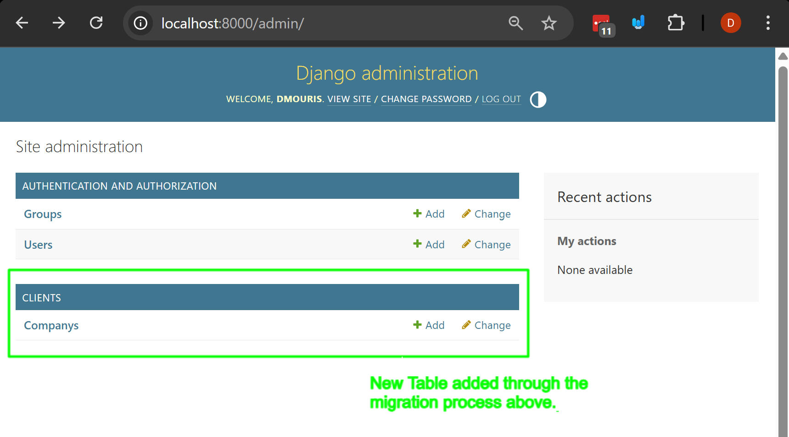

# The Django ORM, Databases, Models, Migrations, and the Admin Fundamentals
In this example we're going to learn more about how django deals with databases, models, and migrations. We will also learn how to use the ORM to interact with the database.

We're going to learn how to:
- Create a model
- Make a migration (generating the SQL to create the table)
- Apply the migration (creating the table in the database)
- Use the ORM to interact with the database

## Prerequisites
- Create a new virtual environment and install the packages from the `requirements.txt` file.

## Steps

### 1. Talking about the Django ORM
In all applications, you need a way to store and retrieve data. You folks took a course on this last semester, so you should be familiar with the concept of a database.

In Django and most web frameworks, you're going to use something called an ORM which stands for Object Relational Mapping. This is a way to interact with the database using Python objects instead of writing raw SQL queries.

The Django ORM has some core concepts that you need to understand below.

#### **Model**: A class that defines the structure of a database table.
  - This is your mapping between Python objects and database tables.
  - We'll take a look at how to do this in the next section.
#### **Migration**: A way to apply changes to the database schema.
  - This is like your `CREATE TABLE` statement in SQL.
  - In django you also have to follow this process to create tables in your database through migrations:
      1. Create a model in your `models.py` file that inherits from `django.db.models.Model`.
      2. Run `python manage.py makemigrations` to create a migration file. This is going to generate the sql to create the table.
      3. Run `python manage.py migrate` to apply the migration and create the table in the database. This is going to execute the `CREATE TABLE` statement in the database mentioned above.
#### **QuerySet**: A collection of database queries that can be filtered, ordered, and manipulated.
  - This is like your `SELECT` statement in SQL.
  - You can use the ORM to create, read, update, and delete records in the database using Python objects.

#### **Django Admin**: A built-in interface for managing your models.
  - This is a web interface that allows you to create, read, update, and delete records in your database using the ORM.
  - This is really powerful so that you can manage and browse your data without having to write any SQL queries.

### 2. Explaining our `clients` app.

We have a django project called `mysoftwarecompany` and an app was already created called clients.
- Note: this was also added to the `INSTALLED_APPS` in the `settings.py` file.

At my software company we want to keep track of our clients which are companies.

We're going to add a model called `Company` to our `clients` app. We're also going to keep track of some Employees that work for the company. So we're going to create a model called `Employee` as well (we'll do this later on.)

### 3. Creating the `Company` model in the `clients/models.py` file.

Open the `clients/models.py` file and add the following code:

```python
from django.db import models


# our model for the client
class Company(models.Model):

    name = models.CharField(max_length=100)
    email = models.EmailField(max_length=100, unique=True)

    def __str__(self):
        return self.name
```
Let's talk about the code above:
- The `Company` class inherits from `models.Model`, which is the base class for all Django models.
  - A model is class that has fields that represent the columns in a database table.
- The `name` field is a `CharField`, which is a string field with a maximum length of 100 characters.
- The `email` field is an `EmailField`, which is a string field that validates the email format and has a maximum length of 100 characters. The `unique=True` argument ensures that no two companies can have the same email address.

Note: In the introductory course we didn't talk that much about the idea of *class inheritance* in Python, but this is a very important concept in object-oriented programming.
- In this case, the `Company` class inherits from `models.Model`, which means it has all the functionality of a Django model. It includes all of the functionality we mentioned above like creating migrations, applying migrations, and using the ORM to interact with the database.

### 4. Making a migration for the `Company` model.
Now that we have created the `Company` model, we need to create a migration for it. This will generate the SQL to create the table in the database.
Run the following command in your terminal:

```bash
python manage.py makemigrations
```
This command will create a migration file in the `clients/migrations` directory. The file will have a name like `0001_initial.py`, which indicates that this is the first migration for the `clients` app.
- Let's go take a look.
- You'll see that there's a migration file which is going to add a table with three fields: `id`, `name`, and `email`. The `id` field is automatically created by Django as the primary key for the table.

Now this code only generates the code for the SQL to create the table, it does not actually create the table in the database. We need to apply the migration to do that.

For this course we're not going to be editing the migration files directly, but you can.

### 5. Applying the migration to create the table in the database.

To apply the migration and create the table in the database, run the following command in your terminal:

```bash
python manage.py migrate
```

This command will execute the SQL generated by the migration file and create the `Company` table in the database.

**IMPORTANT NOTE**: Every time you create a table or add a Field to a model, you'll need to do the previous steps:
1. Create or update the model in `models.py`.
2. Run `python manage.py makemigrations` to create a migration file.
3. Run `python manage.py migrate` to apply the migration and create the table in the database.

Note this is equivalent to running following SQL commands in the database:
```sql
CREATE TABLE "clients_company" (
    "id" INTEGER NOT NULL PRIMARY KEY AUTOINCREMENT,
    "name" VARCHAR(100) NOT NULL,
    "email" VARCHAR(100) NOT NULL UNIQUE
);
```

### 6. Let's add the `Company` model to the Django admin, and create a superuser to browse the admin interface.

Django comes with a built-in admin interface that allows you to manage your models easily. To add the `Company` model to the admin interface, we need to register it in the `clients/admin.py` file.
Open the `clients/admin.py` file and add the following code:

- Let's first "register" the `Company` model in the Django admin interface so that we can manage it easily.

```python
from django.contrib import admin
from .models import Company

# this is going to add it to the admin interface.
admin.site.register(Company)
```

- Let's create a superuser so that we can log in to the admin interface and manage our models.
Run the following command in your terminal:

```bash
python manage.py createsuperuser
```
- This is going to prompt you to enter a username, email, and password for the superuser account. Make sure to remember these credentials as you'll need them to log in to the admin interface.

### 7. Let's add two companies to the database using the Django admin interface.

Run your server and let's go to the admin interface at `http://localhost:8000/admin/`. And enter in the credentials you created for the superuser account.
- You should see the `Company` model listed in the admin interface. 

- Click on the `Company` model and then click on the `Add Company` button to add a new company.
- We're going to create two companies:
  1. **Company Name**: Acme Inc. | **Email**: acme@testing.com
  2. **Company Name**: Cat Sitting International | **Email**: cat.sitting@test.com

- After adding the companies, you should see them listed in the admin interface. You can click on each company to edit or delete them. It should look like this: 

### 8. Let's use the ORM to interact with the database.

Now that we have created the `Company` model and added some companies to the database, let's use the Django ORM to interact with the database.

- Open the Django shell by running the following command in your terminal:

```bash
python manage.py shell
```

- This will open a Python shell with access to your Django project. You can now import the `Company` model and use the ORM to interact with the database.
```python
from clients.models import Company

# Get all of the companies in the database

companies = Company.objects.all()
print(companies)
# Output: <QuerySet [<Company: Acme Inc.>, <Company: Cat Sitting International>]>

# you can access the individual companies in the QuerySet
# using your knowledge of Python lists
cat_sitting_international = companies[1]
print(cat_sitting_international.name)
print(cat_sitting_international.email)

```
A `QuerySet` is a collection (similar to a list or array) of database queries that can be filtered, ordered, and manipulated. In this case, we're getting all of the companies in the database.

**IMPORTANT NOTE**: The `objects` attribute is a manager that provides access to the database. You can use it to create, read, update, and delete records in the database.

*SQL Equivalent*:

Using `objects.all()` on the `Company` model selects all the records in the `clients_company` table and returns them as a `QuerySet`, let's take a look at the SQL that is generated by the ORM.
```python
companies = Company.objects.all()
```
Using SQL:
```sql
SELECT * FROM clients_company;
```

### 9. Filtering the QuerySet and getting a specific record.
You can filter the `QuerySet` to get specific records from the database. For example, if you want to get all companies with a specific name, you can use the `filter()` method.

- Open the django shell again and run the following code:
```python
from clients.models import Company

# Get all of the companies in the database

companies = Company.objects.all()

# Filter the companies by name
# this returns a QuerySet of companies with the name "Acme Inc."
acme_companies = companies.filter(name="Acme Inc.")
print(acme_companies)
# Output: <QuerySet [<Company: Acme Inc.>]>

# get the company with the email cat
cat_sitting_international = Company.objects.get(email="cat.sitting@test.com")
# this is going to return a single Company object
print(cat_sitting_international.name)
# Note this will error if there are multiple companies with the same email address, or if no company is found with that email address.
```

Let's break down the code above:
- `Company.objects.filter(name="Acme Inc.")` filters the `QuerySet` to only include companies with the name "Acme Inc.". This is like a `WHERE` clause in SQL.
*SQL Equivalent*:
```sql
SELECT * FROM clients_company WHERE name = 'Acme Inc.';
```
- `Company.objects.get(email="cat.sitting@test.com")` retrieves a single company with the email " This is like a `SELECT` statement in SQL that returns a single record. Note that `get()` will raise an error if no record is found or if multiple records are found. You should handle this in your code to avoid errors.
*SQL Equivalent*:
```sql
SELECT * FROM clients_company WHERE email = 'cat.sitting@test.com';
```

### 10. Creating a new record in the database.
You can also create new records in the database using the ORM. For example, if you want to create a new company, you can use the `create()` method.
- Open the django shell again and run the following code:
```python
from clients.models import Company

# Create a new company
new_company = Company.objects.create(name="Dog Walking Co.", email="dog.walking@testing.com")
print(new_company)
# Output: <Company: Dog Walking Co.>
```

Let's break down the code above:
- `Company.objects.create(name="Dog Walking Co.", email="dog.walking@testing.com")` Creates a new company. This is like an `INSERT` statement in SQL.
*SQL Equivalent*:
```sql
INSERT INTO clients_company (name, email) VALUES ('Dog Walking Co.', 'dog.walking@testing.com');
```

### 11. Updating a record in the database.
You can update existing records in the database using the ORM. For example, if you want to update the email of a company, you can select the company, update the field and the use the `save()` method to save the changes to the database.

- Open the django shell again and run the following code:
```python
from clients.models import Company

# Get the company with the name "Acme Inc."
acme_company = Company.objects.get(name="Acme Inc.")

# Update the email of the company
acme_company.name="Acme Group of Canada"
acme_company.save()
print(acme_company)
# Output: <Company: Acme Group of Canada>
```
Let's break down the code above:
- `Company.objects.get(name="Acme Inc.")` retrieves the company with the name "Acme Inc.".
- `acme_company.name="Acme Group of Canada"` updates the name of the company, but does not save the changes to the database yet.
- `acme_company.save()` saves the changes to the database. This is like an `UPDATE` statement in SQL.
*SQL Equivalent*:
```sql
UPDATE clients_company SET name = 'Acme Group of Canada' WHERE name = 'Acme Inc.';
```

## Conclusion

In this example, we learned how to use the Django ORM to interact with the database. We created a model, made a migration, applied the migration, and used the ORM to create, read, update, and delete records in the database.
