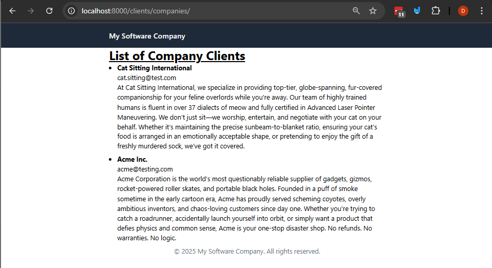

# Django ORM Fundamentals Continued

Today we're going to combine the knowledge we learned from the last modules about templates, views, and URLs with our ORM knowledge to create a simple application that allows us to see records from a database in a template.

This is the core of most web applications, where we retrieve data from a database and display it to the user in a web page.

In the future we'll learn how to add user data safely to the database, but for now, we'll focus on reading data in this example.

## Prerequisites
- Create a new virtual environment and install the packages from the `requirements.txt` file.

- Review the last example and concepts.

## Steps

### 1. Let's Combine our Knowledge of templates, views, and URLs with our ORM knowledge.
In the last module we learned about templates, views, and URLs.

In the last class we learned some of the fundamentals of the django ORM.

Today we're going to combine our knowledge of templates, views, and URLs with our ORM knowledge, to create a simple application that allows us to see records from a database in a template.

- Let's review the models we created in the last module, specifically the `Company` model.
  - This model has fields like `name`, `location`, and `industry`.
  - We can retrieve all companies from the database using the ORM with `Company.objects.all()`.
  - We can filter companies by location or industry using methods like `Company.objects.filter(FILTER_CONDITION)`, where `FILTER_CONDITION` is the condition we want to filter by.
    - We can also get a specific company by its ID using `Company.objects.get(FILTER_CONDITION)` (the only difference is that this will return a single object, while the previous one returns a queryset).

### 2. Let's Add the base template and view and use the ORM to fetch all the companies

- create a folder called `templates` in the root of your project and add the `base.html` template file provided.
- inside of the `clients` app, create a folder called `templates` and inside of it create another folder called `clients`.
- copy the `companies_list.html` template file provided into the `clients/templates/clients` folder.
- In the `clients/views.py` file, create a view called `companies_list` that will:
  - Use the ORM to get all companies from the database.
  - Pass the companies to the `companies_list.html` template.
- Here's what your `companies_list` view should look like:

```python
from django.shortcuts import render

# Create your views here.
from .models import Company


def list_companies(request):
    # this is going to read from
    companies = Company.objects.all()

    return render(request, 'clients/list.html', {'companies': companies})
```
- Observe the `companies_list.html` template file provided, it will display the list of companies.

- Let's add a URL to this view so we can access it in our browser.
  - Create `urls.py` file in the `clients` app if it doesn't exist.
  - In the `clients/urls.py` file, add a URL pattern for the `companies_list` view:
```python
from django.urls import path
from .views import list_companies

urlpatterns = [
    path('companies/', list_companies, name='companies_list'),
]
```
- Now, include the `clients.urls` in the main `urls.py` file of your project:
```python
from django.contrib import admin
from django.urls import path, include
urlpatterns = [
    path('admin/', admin.site.urls),
    path('clients/', include('clients.urls')),  # Include the clients app URLs
]
```

- If you run the server now with `python manage.py runserver` and navigate to `http://localhost:8000/clients/companies/`, you should see the list of companies displayed in the template. Here's what it should look like if everything is set up correctly:


Note you can see all of the companies that we added from the database in the last class.

You can also add more companies to the database using the Django admin interface at `http://localhost:8000/admin/`.

### 3. Let's add some fields to the Company Model
Remember that if we add new fields to the model we need to perform the following steps:
1. Add the new fields to the model in `clients/models.py`.
2. Run `python manage.py makemigrations` to create a migration file for the new fields.
3. Run `python manage.py migrate` to apply the migration and update the database schema.

Let's add a three new fields to the `Company` model:

- description: A text field to describe the company.
- created_at: A date field to store the date when the company was created.
- updated_at: A date field to store the date when the company was last updated.

First we'll add the description field which is a `models.TextField` (docs here https://docs.djangoproject.com/en/5.2/ref/models/fields/#textfield) which is a field for large text, like a description of the company. *In SQL this is usually a `TEXT` type.*

Note: we'll add the `created_at` and `updated_at` fields in a later step, but for now let's focus on the description field.

```python
from django.db import models


# our model for the client
class Company(models.Model):

    name = models.CharField(max_length=100)
    email = models.EmailField(max_length=100, unique=True)
    # company description
    description = models.TextField(blank=True, null=True, default="")


    def __str__(self):
        return self.name
```
- After adding these fields, run the following commands:
```bash
python manage.py makemigrations
```
You should see a message below and a new migration file created in the `migrations` folder of the `clients` app.
```
$ python manage.py makemigrations
Migrations for 'clients':
  clients\migrations\0002_company_created_at_company_description_and_more.py
    + Add field description to company
```
- Run the migrations
```bash
python manage.py migrate
```

### 4. Let's add some data in the admin interface and display it in the template.
- Go to the Django admin interface at `http://localhost:8000/admin/`.
- Log in with the superuser account you created earlier. (*If you haven't created a superuser yet, you can do so by running `python manage.py createsuperuser` and following the prompts.*)
- Navigate to the companies section and a new company with a description, also update the existing companies with descriptions.
You can see the the "description" field in the admin interface when you edit a company.


- Now, let's update the `companies_list.html` template to display the description of each company. Update the template to include the description field:
```html
<!-- ...rest of the template... -->

    <li class="mb-2">
        <strong>{{ company.name }}</strong>
        <div>
            {{company.email}}
        </div>
        <!-- New field created -->
        <p>{{company.description}}</p>
    </li>

```


### 5. Let's add some date fields to the Company Model
Now let's add the `created_at` and `updated_at` fields to the `Company` model.
- Update the `Company` model in `clients/models.py` to include the new fields:
```python
from django.db import models
# our model for the client

class Company(models.Model):
    name = models.CharField(max_length=100)
    email = models.EmailField(max_length=100, unique=True)
    description = models.TextField(blank=True, null=True, default="")
    created_at = models.DateTimeField(auto_now_add=True)  # Automatically set the field to now when the object is first created
    updated_at = models.DateTimeField(auto_now=True)  # Automatically set the field to now every time the object is saved

    def __str__(self):
        return self.name

```
- Notes about the above:
  - in a Django model, `DateTimeField` is used to store date and time values.
  - `auto_now_add=True` means that the field will be set to the current date and time when the object is created.
  - `auto_now=True` means that the field will be updated to the current date and time every time the object is saved.


- After adding these fields, run the following commands:
```bash
python manage.py makemigrations
```
You should see a message below and a new migration file created in the `migrations` folder of the `clients` app.
```
It is impossible to add the field 'created_at' with 'auto_now_add=True' to company without providing a default. This is because the database needs something to populate existing rows.
 1) Provide a one-off default now which will be set on all existing rows
 2) Quit and manually define a default value in models.py.
Select an option: 1
Please enter the default value as valid Python.
Accept the default 'timezone.now' by pressing 'Enter' or provide another value.
The datetime and django.utils.timezone modules are available, so it is possible to provide e.g. timezone.now as a value.
Type 'exit' to exit this prompt
[default: timezone.now] >>>
Migrations for 'clients':
  clients\migrations\0003_company_created_at_company_updated_at.py
    + Add field created_at to company
    + Add field updated_at to company
```
In the above prompt, we provided a default value for the `created_at` field, which is `timezone.now`. This will set the current date and time for all existing rows in the database.

Note we
- Run the migrations
```bash
python manage.py migrate
```

Now the `created_at` and `updated_at` fields are added to the `Company` model, and they will automatically be set when a company is created or updated.

- Let's create a new company in the admin interface and see the `created_at` and `updated_at` fields in action.
- Add the following company
- Name: "Tech Innovations"
- Email: "tech.inno@test.com"
- Description: "A leading company in tech innovations."

- Let's update the `companies_list.html` template to display the `created_at` and `updated_at` fields:
```html
<!-- ...rest of the template... -->

    <li class="mb-2">
        <strong>{{ company.name }}</strong>
        <div>
            {{company.email}}
        </div>
        <p>{{company.description}}</p>
        <p>Created at: {{ company.created_at }}</p>
        <p>Information Last updated: {{ company.updated_at }}</p>
    </li>

```

### 6. More on the ORM.
There's a lot more field core field types in django, and you can find the full list in the [Django documentation](https://docs.djangoproject.com/en/5.2/ref/models/fields/).
Here's a quick summary of some of the most commonly used field types:
- `CharField`: A short text field, used for small strings like names or titles.
- `TextField`: A large text field, used for longer strings like descriptions or comments.
- `IntegerField`: A field for storing integers.
- `FloatField`: A field for storing floating-point numbers.
- `BooleanField`: A field for storing boolean values (True/False).
- `DateField`: A field for storing dates.
- `DateTimeField`: A field for storing date and time values.
- `EmailField`: A field for storing email addresses, which includes validation to ensure the value is a valid email format.
- `URLField`: A field for storing URLs, which includes validation to ensure the value is a valid URL format.

In the next class we'll learn how to add relationships between models just like foreign keys in SQL, and how to use the ORM to query related data.


## Challenge/Exercise
- Add a new field to the `Company` model called `website`, which is a URL field.
- Update the `companies_list.html` template to display the website of each company.
- Add a url to the website field in the admin interface so that it opens in a new tab when clicked.

## Conclusion

In this example we learned how to combine our knowledge of templates, views, and URLs with our ORM knowledge to create a simple application that allows us to see records from a database in a template.
