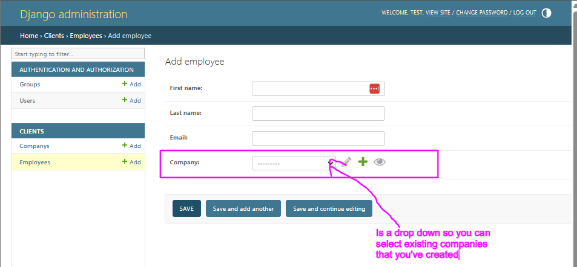

# Django ORM with Model Relationships

So far we've taken a look at the core fields available in Django Models, and how to use the ORM to create, update, and delete records.

In this example, we'll build on this knowledge and create some relationships between models, and some templates so that we can see the data in the web application.

## Prerequisites
- Create a new virtual environment and install the packages from the `requirements.txt` file.

- Review the last example and concepts.

## Steps

### 1. Let's talk about the relationships we're going to create in the `clients` app.

So far we've create a `Company` model inside of our `clients` app.

We're going to add a couple more models to this app shown in the diagram below.

- `Employee` model, this is going to have a one-to-many relationship to the `Company` model.
  - So one `Company` can have many `Employees`.
- `Role` model, this is going to have a one-to-many relationship with the `Employee` model.
  - So one `Role` can be assigned to many `Employees`, but one `Employee` can only have one `Role`.

You folks remember how to do this in SQL from last semester, so we're going to do the same idea with Django's ORM, using the `ForeignKey` field type to create these relationships.
- There's also a `ManyToManyField` and `OneToOneField` that we can use to create different types of relationships, but for this example we're going to focus on the `ForeignKey` field type.

We're going to be doing this in a couple of steps:
1. we're going to create the `Employee` model and add the `ForeignKey` field to the `Company` model
2. we're going to add this model to the admin so we can see it in the admin interface, and add an employee to a company.
3. Then we're going to create the `Role` model and add the `ForeignKey` field to the `Employee` model, we're also going to make so that an employee can have no role (left blank)

We're also going to make a short script that will load some data for us (we'll be creating this as management commands later in the course).

### 2. Create the `Employee` model
In the `clients/models.py` file, add the following code to create the `Employee` model:

```python
# ... company model above ...

class Employee(models.Model):
    # core fields
    first_name = models.CharField(max_length=50)
    last_name = models.CharField(max_length=50)
    email = models.EmailField(max_length=100, unique=True)

    # We're going to be adding these quite commonly.
    created_at = models.DateTimeField(auto_now_add=True)  # Automatically set the field to now when the object is first created
    updated_at = models.DateTimeField(auto_now=True)

    # Foreign key relationship to the Company model
    # This creates a many-to-one relationship where each employee belongs to one company
    # the models.CASCADE means that if the company is deleted, all related employees will also be deleted.
    # the related_name allows you to access the employees from the company instance using company.employees.all()
    company = models.ForeignKey(Company, on_delete=models.CASCADE, related_name='employees')

    def __str__(self):
        # note that you can use self.company to access the str representation of the related Company instance
        return f"{self.first_name} {self.last_name} works at {self.company.name}"

```
Let's talk about the code above:
- We defined core fields for the `Employee` model, including `first_name`, `last_name`, and `email`.
- We added `created_at` and `updated_at` fields to track when the employee was created and last updated.
- We created a `ForeignKey` relationship to the `Company` model, which allows us to associate each employee with a specific company.
- The `on_delete=models.CASCADE` argument means that if a company is deleted, all employees associated with that company will also be deleted.
- The `related_name='employees'` argument allows us to access all employees of a company using `company.employees.all()`.
- You can also note that the `__str__` method is defined to return a string representation of the employee, which includes their name and the company they work for. The `company` field will use the `__str__` method of the `Company` model to display the company name.

Let's create the migration for this model:
```bash
python manage.py makemigrations clients
```
- Note that you can also add the `clients` app to the `makemigration` command to only create migrations for that app.
- Let's take a quick look at the migration file that was created in the `clients/migrations/` directory. You should see a file named `0004_employee.py` or similar, which contains the migration code for creating the `Employee` model.

Let's apply the migration to create the `Employee` table in the database:
```bash
python manage.py migrate clients
```

### 3. Register the `Employee` model in the admin interface, and add an employee to a company using the admin interface.

In the `clients/admin.py` file, add the following code to register the `Employee` model:

```python
from django.contrib import admin
from .models import Company, Employee # import the Employee model

admin.site.register(Company)

# our new Employee model to the admin.
admin.site.register(Employee)
```
Now let's run our dev server with `python manage.py runserver` and go to the admin interface at `http://localhost:8000/admin/`.
- Note you should be able to login with the superuser account you created earlier.

You should see the `Employee` model listed under the `Clients` app in the admin interface. Click on it to add a new employee.


Let's add a single new employee using the admin interface.
- first name: gary
- last name: smith
- email: gary.smith@acmetesting.com
- company: Acme

Click save and you should see the new employee listed in the admin interface.

### 4. Get results from the `Employee` models using the ORM and explain how some of the queries work with the relationships we've created.

Let's open the python shell to explore how to use the employee model.
```
python manage.py shell
```
Inside of the shell, let's import Employee and Company models:
and let's get the company named "Acme".
```python
from clients.models import Employee, Company

acme_company = Company.objects.get(name="Acme Inc.")
# if you get an error make sure you have the correct company name
# You can check this in the admin interface or by running:
# Company.objects.all()
```
Now there's a couple of ways you can get all of the employees for this company. The first way is to use our knowledge of `objects.filter()` using the `company` field:
```python
acme_employees_one = Employee.objects.filter(company=acme_company)
# return a QuerySet of all employees for the Acme company
```
The second way is to use the `related_name` we defined in the `Employee` model, which allows us to access all employees of a company directly from the company instance:
```python
acme_employees_two = acme_company.employees.all()
# return a QuerySet of all employees for the Acme company
```
**IMPORTANT** Notes on the relationships:
  - on the `Employee` model the way to refer to the company is through the `company` field, which is a ForeignKey to the `Company` model.
  - on the `Company` model, the way to refer to the employees is through the `related_name` we defined in the `ForeignKey` of `company` in the `Employee` model, which is `employees`.

Both of these return the same result, a QuerySet of all employees for the Acme company.

*Both of these In SQL this would be equivalent to:*
```sql
SELECT * FROM clients_employee WHERE company_id = acme_company.id;
```

### 5. Let's create some employees for the acme company using the ORM.
Just like above let's open the python shell:
```bash
python manage.py shell
```
Import the `Employee` and `Company` models and get the `acme_company` instance:

```python
from clients.models import Employee, Company
acme_company = Company.objects.get(name="Acme Inc.")


```
using the data from `employes_to_add.py` (copy the contents to the file into the shell) let's get the first employee.

```python
# copy the lists from `
new_employee_data = new_employees_data_acme[0]  # Get the first employee data which is a dictionary.

# create a new instance of the Employee model
# note that this will not be saved yet
new_employee = Employee(
    first_name=new_employee_data['first_name'],
    last_name=new_employee_data['last_name'],
    email=new_employee_data['email'],
    company=acme_company  # Set the company to the acme_company instance
)

new_employee.save()  # Save the new employee to the database
```
Let's talk about the code above:
- We created a new instance of the `Employee` model using the data from the `new_employees_data_acme` list.
- We set the `company` field to the `acme_company` instance, which establishes the relationship between the employee and the company.
- Finally, we called the `save()` method to save the new employee to the database.

Let's do this using a slightly different way, using the `create()` method of the `Employee` model's manager:
```python
# Create a new employee using the create() method

another_new_employee_data = new_employees_data_acme[1]  # Get the second employee data which is a dictionary.

# you can use the create() method to create and save the employee in one step
new_employee_two = Employee.objects.create(
    first_name=another_new_employee_data['first_name'],
    last_name=another_new_employee_data['last_name'],
    email=another_new_employee_data['email'],
    company=acme_company  # Set the company to the acme_company instance
)
```
This is a slightly more concise way to create and save a new employee in one step.
*In SQL this would be equivalent to:*
```sql
INSERT INTO clients_employee (first_name, last_name, email, company_id)
VALUES (
    'Alice',
    'Johnson',
    'alice.johnson@acmetesting.com',
    'Acme'
)
```
Now if you select all of the employees for the Acme company, you should see the two new employees we just created!

### 6. Let's create the `Role` model and add the `ForeignKey` field to the `Employee` model.
In the `clients/models.py` file, add the following code to create the `Role` model:

```python
# ... The Company model ...

class Role(models.Model):
    # core fields
    name = models.CharField(max_length=50, unique=True)
    description = models.TextField(blank=True, null=True)  # optional field

    # We're going to be adding these quite commonly.
    created_at = models.DateTimeField(auto_now_add=True)  # Automatically set the field to now when the object is first created
    updated_at = models.DateTimeField(auto_now=True)

    def __str__(self):
        return self.name

# ... the Employee model below ...
```
So this is going to create a `Role` model with a `name` and an optional `description`. The `created_at` and `updated_at` fields are added to track when the role was created and last updated.

Now let's add a `ForeignKey` field to the `Employee` model to create a one-to-many relationship with the `Role` model. This means that each employee can have one role, but a role can be assigned to many employees.
```python
# Add this to the Employee model
class Employee(models.Model):
    # ... existing fields ...

    # Foreign key relationship to the Role model
    # This creates a many-to-one relationship where each employee can have one role
    # the models.SET_NULL means that if the role is deleted, the employee's role will be set to null.
    # the related_name allows you to access the role from the employee instance using employee.role
    role = models.ForeignKey(Role, on_delete=models.SET_NULL, blank=True, null=True, related_name='employees')

    def __str__(self):
        return f"{self.first_name} {self.last_name} works at {self.company.name} as {self.role.name if self.role else 'No Role'}"
```
Let's talk about the code above:
- We defined a `Role` model with a `name` and an optional `description`.
- We added a `ForeignKey` field to the `Employee` model to create a one-to-many relationship with the `Role` model.
- The `on_delete=models.SET_NULL` argument means that if a role is deleted, the employee's role will be set to null (i.e., the employee will have no role).
- The `blank=True, null=True` arguments allow the role field to be optional, meaning an employee can have no role assigned.

Let's create the migrations for the `Role` model and the updated `Employee` model:
```bash
python manage.py makemigrations clients
```
- Note you can always look at the migration files in the `clients/migrations/` directory to see the changes that were made.

Let's apply the migrations to create the `Role` table and update the `Employee` table in the database:
```bash
python manage.py migrate clients
```

Let's register the `Role` model in the admin interface, so we can add roles to employees.
In the `clients/admin.py` file, add the following code to register the `Role` model:

```python
from django.contrib import admin
from .models import Company, Employee, Role  # import the Role model
admin.site.register(Company)
admin.site.register(Employee)

admin.site.register(Role)  # register the Role model
```

### 7. Let's add a couple of roles using the ORM.
You folks probably are comfortable using the admin interface to add roles, so let's do this using the ORM instead.

We're going to add a couple of roles using the ORM in the python shell.
- Roles:
  - name: `CEO`, description: `Chief Executive Officer`
  - name: `Manager`, description: `Manages a team of employees`
  - name: `Developer`, description: `Writes code and develops software`

open the python shell:
```bash
python manage.py shell
```
and let's import the `Role` model and create all of the roles using the method on the orm.
- We're going to use the `get_or_create()` method to create the roles, which will create the role if it doesn't exist, or return the existing role if it does. This is a useful method to avoid creating duplicate roles, or having an error if the role already exists.
```python
from clients.models import Role

roles_data = [
    {"name": "CEO", "description": "Chief Executive Officer"},
    {"name": "Manager", "description": "Manages a team of employees"},
    {"name": "Developer", "description": "Writes code and develops software"}
]

for role_data in roles_data:
    role, created = Role.objects.get_or_create(
        name=role_data['name'],
        description=role_data['description']
    )
    if created:
        print(f"Created role: {role.name}")
    else:
        print(f"Role already exists: {role.name}")
```
Let's talk about the code above.
- We defined a list of dictionaries containing the role data.
- We looped through the list and used the `get_or_create()` method to create the role if it doesn't exist, or return the existing role if it does.
  - The `get_or_create()` method returns a tuple containing the role instance and a boolean indicating whether the role was created or not.
  - We printed a message indicating whether the role was created or already exists.
- If you run this code again then you will not create any new roles, but it will print a message indicating that the role already exists.

### 8. Assign roles to employees using the ORM.
Now that we have the roles created, let's assign some roles to the employees we created earlier using the ORM.
```python
# Let's get the employees we created earlier
from clients.models import Employee, Role

# here we're filtering on the "name" field on the "company" model
# with the "company__name" lookup.
acme_employees = Employee.objects.filter(company__name="Acme Inc.")

# Let's get the roles we created earlier
roles = Role.objects.all()

# let's get the first employee and assign the ceo role to them

# Get the first employee, .first() returns first object in the QuerySet or None if no objects exist
first_employee = acme_employees.first()

role_ceo = roles.get(name="CEO")  # Get the CEO role

# let's update the first employee's role to the CEO role
first_employee.role = role_ceo
first_employee.save()  # Save the changes to the employee
# Let's print the first employee's role to verify
print(f"{first_employee.first_name} {first_employee.last_name} is now assigned the role of {first_employee.role.name}")
```

### 9. Let's create a script to load some of the data.
Let's use the script `load_employees.py` in the root of the folder, note later we'll use something called a management command to do this.
- The file called `load_employees.py` at the root of the folder has some code that will setup django in a script so that you can use the ORM to create records in the database.
- Import the models `Employee`, `Company`, and `Role` from the `clients` app into the script.
- Copy over list `new_employees_data_cat_sitting_int` in the `employees_to_add.py` into our `load_employees.py` script.

```python
# ... boiler plate code to setup django in a script ...
from clients.models import Employee, Company, Role

# ... copy the new_employees_data_cat_sitting_int list from employees_to_add.py here ...

def main():

    for employee_data in new_employees_data_cat_sitting_int:
        # Get or create the company
        company, created = Company.objects.get_or_create(name=employee_data["company"])

        # Get or create the role
        role, created = Role.objects.get_or_create(name=employee_data["role"])

        # Create the employee
        employee, created = Employee.objects.get_or_create(
            first_name=employee_data["first_name"],
            last_name=employee_data["last_name"],
            email=employee_data["email"],
            company=company,
            role=role,
        )
        if created:
            # If the employee was created, print a message
            print(f"Created new employee: {employee}")
        else:
            # If the employee already exists, print a message
            print(f"Employee: {employee} already exists, skipping creation.")

if __name__ == "__main__":
    main()
    print("All employees have been processed.")

```
Let's talk about the code above:
- We imported the `Employee`, `Company`, and `Role` models from the `clients` app.
- We defined a `main()` function that will be executed when the script is run.
- In the loop we did a few things
  - We used `get_or_create()` to get or create the company and role based on the data in the `new_employees_data_cat_sitting_int` list.
  - We used `get_or_create()` to create the employee, which will create the employee if it doesn't exist, or return the existing employee if it does.
  - We printed a message indicating whether the employee was created or already exists.

## Challenge/Exercise

1. Create a `Department` model that has one field `name` and a `ForeignKey` relationship to the `Company` model.
  - The `company` field should use the `on_delete=models.CASCADE` argument, so that if a company is deleted, all related departments will also be deleted.

2. Update the `Employee` model to have a `ForeignKey` relationship to the `Department` model.
  - The `department` field should use the `on_delete=models.SET_NULL` argument, so that if a department is deleted, the employee's department will be set to null.

3. Add this model to the admin interface so you can add departments to companies and assign employees to departments.

4.  Create a migration and apply it to the database.
5. Using the ORM create two departments for the Acme company, and assign one employees to the department.


## Conclusion

In this example, we learned how to create relationships between models using Django's ORM. We created an `Employee` model with a `ForeignKey` relationship to the `Company` model, and a `Role` model with a `ForeignKey` relationship to the `Employee` model. We also learned how to use the ORM to create, update, and query records with these relationships.

We also created a script to load some data into the database using the ORM. This is a common pattern in Django applications, and we'll be using it more in the future as we build out our application.

